# InferenceRig

[](https://github.com/antonikliment/InferenceRig/releases/latest)
[](https://github.com/antonikliment/InferenceRig/actions/workflows/test.yml)
[](https://github.com/antonikliment/InferenceRig/actions/workflows/lint.yml)
[](https://github.com/antonikliment/InferenceRig/actions/workflows/e2e.yml)

A neutral local control plane for language-model inference engines. Write one
canonical YAML **profile** per model setup, then start, stop, switch and monitor
it from whichever surface suits you: a TUI, a web GUI, a CLI, or an MCP client.

Engine specifics live behind a backend interface, so the same profile format,
the same commands and the same API drive either engine:

- **llama.cpp** — one process serves several profiles, told which to activate
- **Apple MLX** — one process serves one profile

What it does:

- start, stop, restart, reset and status for profile runtimes
- create, read, replace, delete and autostart canonical YAML profiles
- browse and download models from a remote catalog, with fit estimates for your
  machine, and apply a finished download to a profile
- install, roll back and inspect the engine binaries themselves
- host telemetry (RAM, CPU, accelerator) in the TUI, web GUI and API
- an event stream and audit log tying every state transition of a start, stop
  or reset together by operation ID

The command is `infr`.

> Support claims are evidence-graded in
> [`docs/hardware-validation.md`](docs/hardware-validation.md) — read that
> before assuming a platform works.

## Install

Released binaries cover Linux (amd64, arm64) and macOS (amd64, arm64). Go,
Node.js, and pnpm are not needed. Windows is not a target because the local
control transport is a Unix socket.

Inspect the script before running it. It downloads a release tarball, verifies
its checksum and, when [`gh`](https://cli.github.com/) is installed, its GitHub
build provenance attestation, then extracts the binary:

```bash
curl -fsSL -o install.sh https://raw.githubusercontent.com/antonikliment/InferenceRig/main/internal/installer/install.sh
less install.sh   # read it
sh install.sh                # latest stable release
sh install.sh dev             # latest release, prereleases included
sh install.sh v0.1.0          # pin an exact release
```

`INSTALL_DIR` overrides the install location (default `/usr/local/bin`, falling
back to `~/.local/bin`). Re-running upgrades in place. To remove it, delete the
binary from wherever it printed.

Each release also publishes `SHA256SUMS` and a CycloneDX SBOM (`*.cdx.json`)
per binary, so you can verify by hand instead of trusting the script:

```bash
sha256sum --ignore-missing --check SHA256SUMS
gh attestation verify inferencerig_<version>_<os>_<arch>.tar.gz --repo antonikliment/InferenceRig
```

The macOS binaries are ad-hoc built, not Developer ID signed or notarized —
`curl`/`install.sh` is unaffected, but a browser download will need an explicit
Gatekeeper override (right-click → Open, or System Settings → Privacy &
Security → Open Anyway) on first launch. See
[`docs/research/release-supply-chain.md`](docs/research/release-supply-chain.md)
for why.

## First run

`infr` with no arguments opens the **TUI** — the front door for interactive
use. The first run in an interactive terminal walks you through a setup wizard
(listen address, model storage, which services start automatically) and writes
`~/.inferencerig/config.yaml`. For non-interactive startup (scripts, systemd,
containers) create that file first or set `INFERENCERIG_CONFIG`; the wizard only
runs on a terminal. `infr setup` re-runs it on demand.

From the TUI you can start and stop both services, install a backend, create a
profile, download a model into it and start it. Once the web gateway is running
it prints a URL with a login token in the fragment:

```text
http://127.0.0.1:7000/#token=...
```

The home directory (`~/.inferencerig` by default, `INFERENCERIG_HOME` to move
it) keeps everything: `config.yaml`, `profiles/`, `models/`, `run/`, `logs/`.

## Control planes

- **[CLI](docs/cli.md)** — commands for scripts and terminal workflows.
- **[TUI](docs/tui.md)** — full-screen dashboard and keyboard controls.
- **[Web UI](docs/web-ui.md)** — browser sections and controls.
- **MCP** — tools exposed at the gateway's `/mcp` endpoint.

## The two services

InferenceRig runs as two independent local processes:

| Service | Command | Transport | Purpose |
|---|---|---|---|
| **control daemon** | `infr serve` | Unix socket (`~/.inferencerig/run/control.sock`) | Owns runtime orchestration, profiles, downloads and the `ControlService` RPC every other surface calls. No GUI, no TCP listener. |
| **web gateway** | `infr web` | TCP, `listen_addr` (default `127.0.0.1:7000`) | Serves the web GUI, the same `ControlService` over Connect, `/health` and `/mcp`. Talks to the control daemon over that socket. |

```bash
infr serve --detach     # foreground without the flag
infr daemon status
infr daemon stop
infr web
```

`startup_services` in `config.yaml` controls which of these the TUI starts
automatically on launch — `control`, `web`, or both. Manual `infr serve` /
`infr web` work regardless of that setting.

To run the control daemon as a native per-user service:

```bash
infr service generate systemd    # or launchd — prints the unit
infr service install
infr service uninstall
```

## Screenshots

### Web UI

Served by `infr web` at `listen_addr` (default `127.0.0.1:7000`) — profile,
model, and runtime management, plus daemon and engine logs.

| Dashboard | System resources |
|---|---|
| 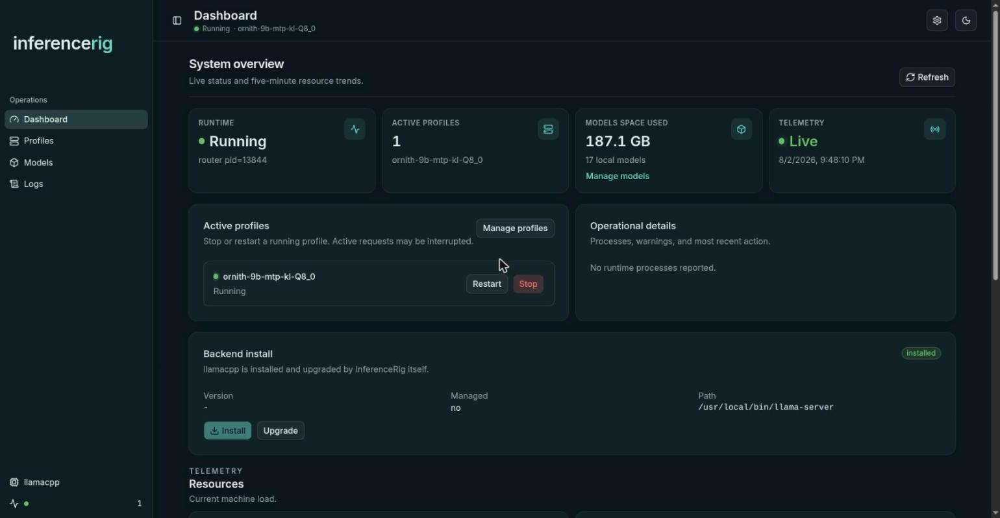 | 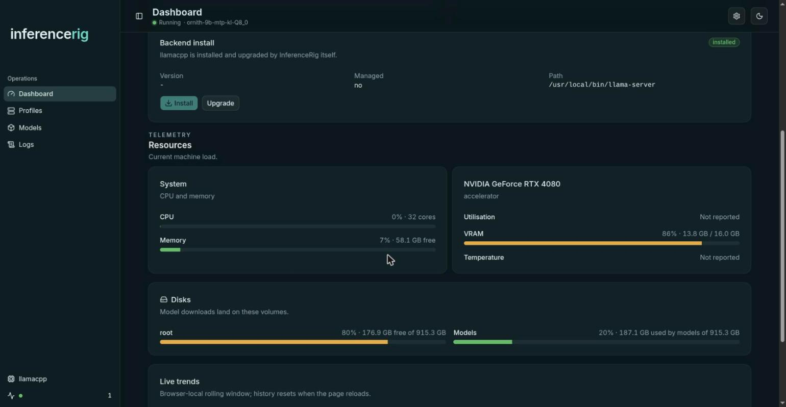 |

| Profile editor | Model catalog |
|---|---|
| 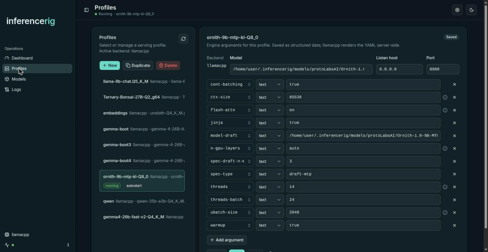 | 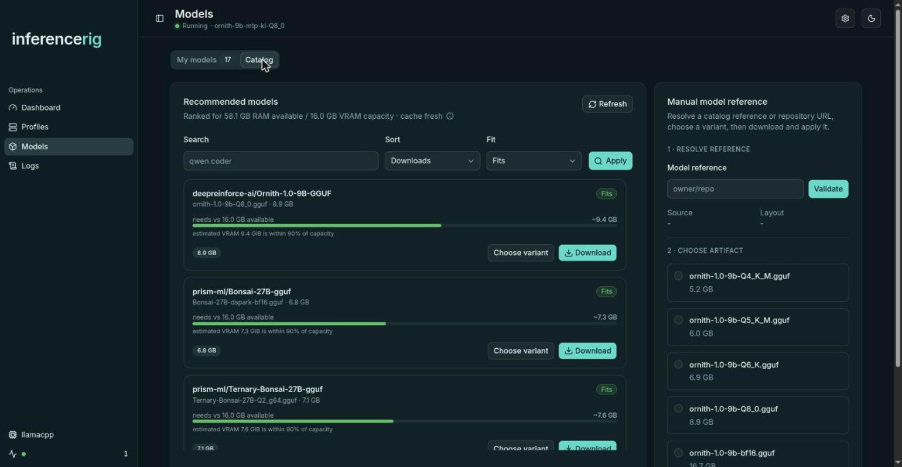 |

| Daemon events | Engine log |
|---|---|
| 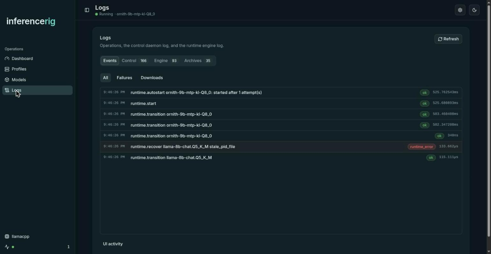 | 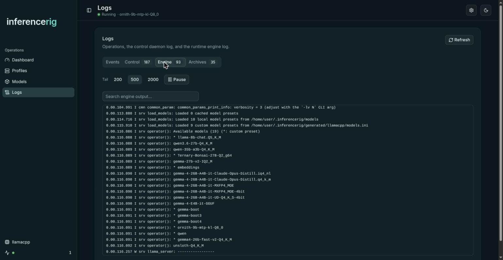 |

### TUI

`infr` (no args) or `infr tui` — full-screen dashboard for both services,
profile and runtime status, host resources.

| Services | Models |
|---|---|
| 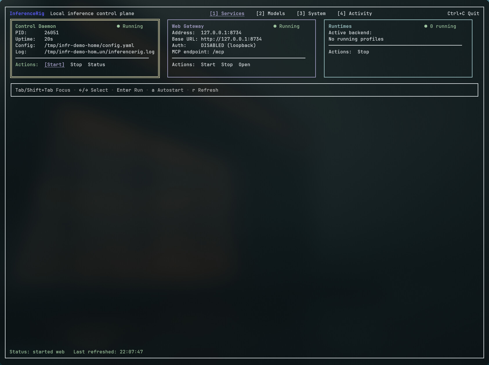 | 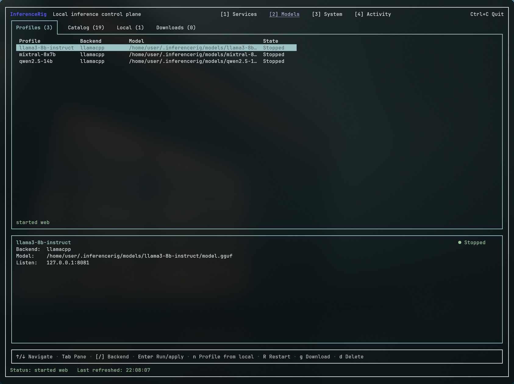 |

| System |
|---|
| 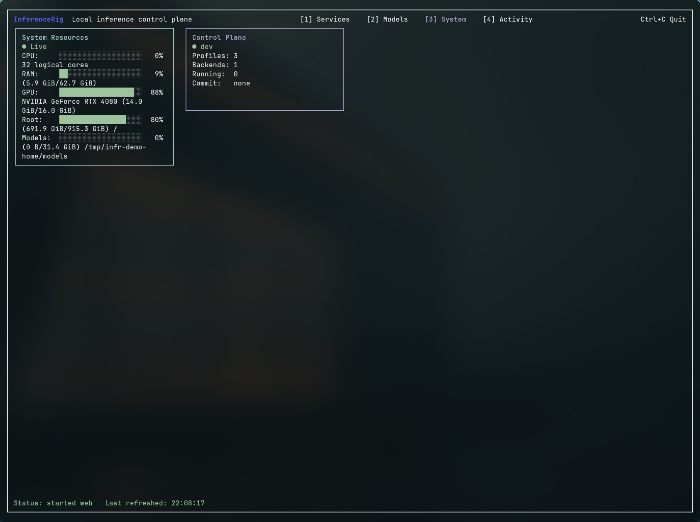 |

| Activity — events | Activity — control audit log |
|---|---|
| 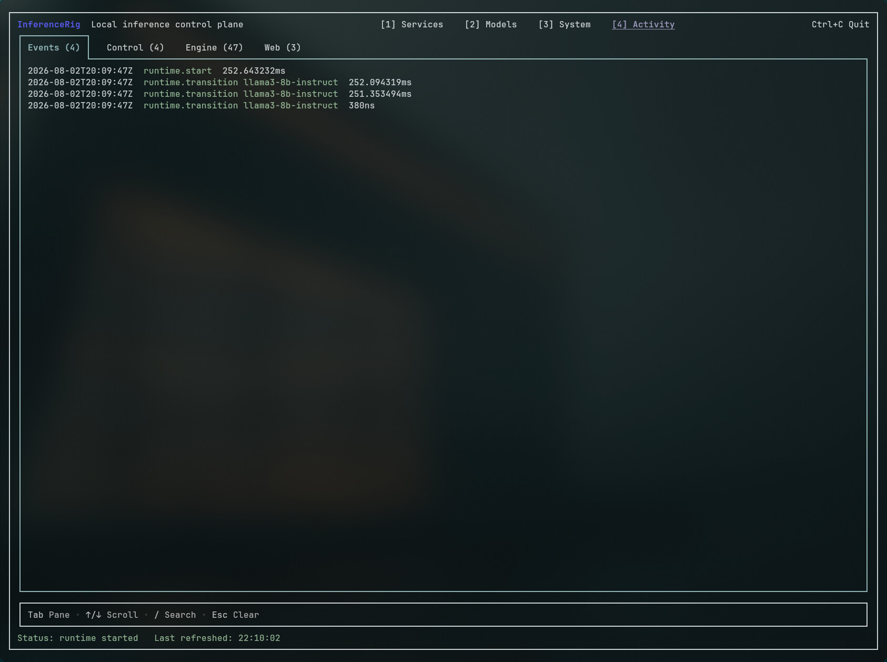 | 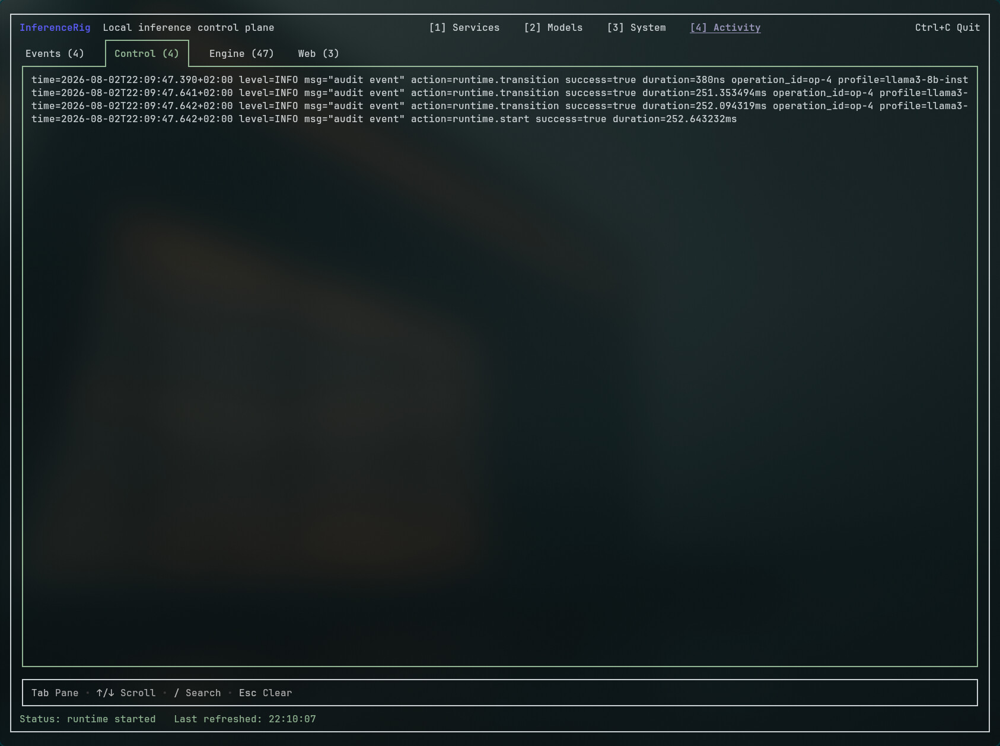 |

| Activity — engine log |
|---|
| 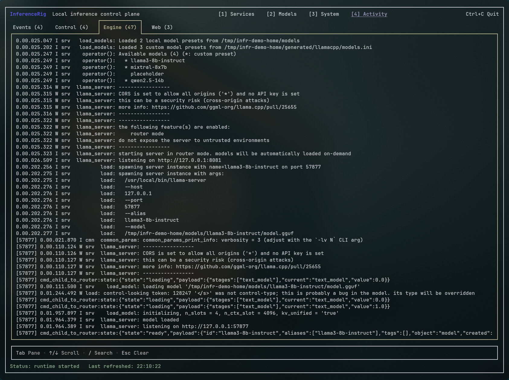 |

## Profiles

A profile is canonical YAML at `~/.inferencerig/profiles/<name>/profile.yaml`.
It names a backend, a model and a listen address; everything engine-specific is
confined to `engine_args`, which is passed through to that engine:

```yaml
version: 1
name: dev
backend: llamacpp
model:
  source: /path/to/model.gguf
listen:
  host: 127.0.0.1
  port: 8080
engine_args:
  ctx-size: 8192
```

`model.source` is whatever the profile's backend resolves — a local model path,
or a catalog reference it can download. Engine-native config (llama.cpp's
`models.ini`, for instance) is *generated* from the profile before launch; the
YAML is canonical, and regeneration overwrites hand edits to the generated file.

InferenceRig serves **one backend at a time**. While a runtime exists, a profile
naming a different backend cannot start; `infr runtime reset` stops everything
and clears the slot. On a backend that serves one profile per process, starting
a second profile is a conflict unless you pass `--replace` — no client, MCP
included, can terminate a running engine without saying so. The full vocabulary
is in [`CONTEXT.md`](CONTEXT.md).

## Configuration

Config is loaded from `INFERENCERIG_CONFIG`, then `~/.inferencerig/config.yaml`.
Set `INFERENCERIG_HOME` to relocate the home directory. `infr config validate`
answers "would the daemon start with this file?" without starting a daemon — it
runs startup's own loader, so its verdict is startup's.

Defaults:

- listen address: `127.0.0.1:7000`
- startup services: `control`, `web` (both)
- profiles: `~/.inferencerig/profiles/`
- model storage: `~/.inferencerig/models`
- catalog cache: `~/.inferencerig/cache/hf-catalog`, TTL `6h`
- log archive retention: `168h` (`0s` keeps archives indefinitely)
- autostart: profiles listed in `autostart_profiles`

See [`config.example.yaml`](config.example.yaml) for the annotated file.

## Security

This process controls engine subprocesses and edits config on disk. Treat it as
trusted local tooling.

The gateway requires a bearer token by default. If `security.auth_token_env`
names no variable set in the environment, the gateway generates a token,
persists it to `~/.inferencerig/run/gateway.token`, and prints a
`http://host:port/#token=…` URL — the token rides in the fragment, which is
never sent to a server and so cannot land in an access log. Every procedure,
including the event, log and catalog **streams**, is guarded.

Two deliberate opt-outs exist, both documented in `config.example.yaml`:

- `security.disable_origin_check` — for a reverse proxy that terminates the
  browser origin itself (see [`docs/reverse-proxy.md`](docs/reverse-proxy.md)).
  `security.allowed_origins` is the narrower alternative.
- `security.disable_auth` — serves everything unauthenticated. On a non-loopback
  bind it is *refused* unless `security.allow_exposed_without_auth` is also set,
  and it is always announced on startup.

The control daemon's Unix socket intentionally has no bearer auth: it is
local-process control plumbing. Do not expose it outside the local filesystem.

### Supply chain

Every pull request runs a `Security` check alongside `Test` and `Lint`:
`govulncheck` over the Go module, CodeQL over the Go and Svelte/TypeScript
sources, `pnpm audit` over the web lockfile, `gitleaks` over the full history,
and `zizmor` over the workflows themselves. It also runs weekly, because a
vulnerability disclosed against a dependency nobody touched produces no commit
to trigger on.

A release cannot publish unless that check passed on its commit, and each of
the four packaged binaries is scanned again with `govulncheck -mode=binary`
after packaging — so what is verified is the bytes being shipped, not just the
source they came from. Run the same module scan locally with `make vuln`.

## HTTP

The gateway serves the web GUI plus:

- the canonical `ControlService` over **Connect** (unary methods plus the
  `WatchEvents`, `WatchLogs` and `WatchModelCatalog` streams), token-guarded
- `GET /health` — unauthenticated liveness and auth posture, for load balancers
  and shell scripts that cannot hold a token or speak Connect
- `/mcp` — token-guarded

```bash
curl http://127.0.0.1:7000/health
# {"ok":true,"service":"...","auth":"required"}
```

There is deliberately **no hand-written REST facade**. The browser talks the
same proto service the CLI and TUI do, so the wire contract is
`core/rpc/proto/inferencerig/control/v1/control.proto` and nothing has to be
kept in sync by hand.

## MCP

MCP JSON-RPC endpoint, served by the gateway:

```text
http://127.0.0.1:7000/mcp
```

Tools: `backends_list`, `backend_install`, `backend_install_status`,
`backend_params`, `profiles_list`, `profile_get`, `profile_put`,
`profile_delete`, `profile_cleanup`, `profile_autostart`, `catalog_search`,
`models_local`, `model_delete`, `model_resolve`, `download_start`,
`download_get`, `download_cancel`, `download_apply`, `runtime_status`,
`runtime_start`, `runtime_stop`, `runtime_restart`, `runtime_reset`,
`info_get`, `signals_get`, `events_list`, `startup_services_set`.

## Development

Building from source requires Go (see `go.mod` for the minimum version) and
Node.js with [pnpm](https://pnpm.io/) through `corepack`. Build the web UI once
per checkout, then build the Go binary:

```bash
corepack enable pnpm
cd webui && pnpm install && pnpm run build && cd ..
go build -o infr .
./infr
```

Common checks:

```bash
make build      # go build ./...
make test       # go test ./...
make lint       # custom golangci-lint
make verify     # test + lint
make vuln       # govulncheck (needs network; not part of verify)
make coverage   # scoped coverage floor
make generate   # regenerate proto (buf)
```

Read [`docs/architecture-overview.md`](docs/architecture-overview.md) before
touching code — it maps the layers, the one-way import direction
(`adapters` → `core` → `backends`/`platform`) and the entry-point file per area.
[`AGENTS.md`](AGENTS.md) holds the rules that constrain changes, chiefly the
neutrality rule: no shared package may name or import an engine.

End-to-end suites run a compiled binary against a real engine and a real model.
A missing fixture fails them; it is never a skip.

```bash
make e2e            # llama.cpp, pinned engine + model
make e2e-browser    # one Chromium workflow over the same harness
make e2e-live-mlx   # MLX, Apple Silicon only
```

What each test layer does and does not prove is defined in
[`docs/hardware-validation.md`](docs/hardware-validation.md).

For web GUI development run Vite directly, or point the Go process at a local
build:

```bash
cd webui && pnpm run dev

cd webui && pnpm run build && cd ..
INFERENCERIG_APP_DIR=./webui/dist infr web
```

## License

MIT — see [`LICENSE`](LICENSE).
